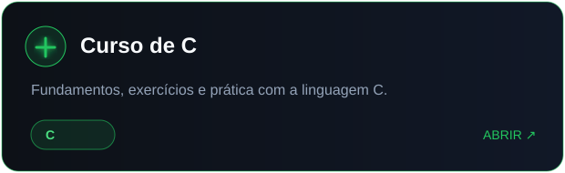
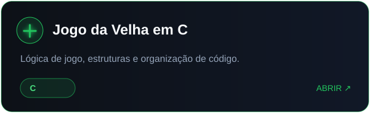
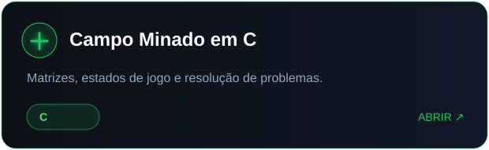
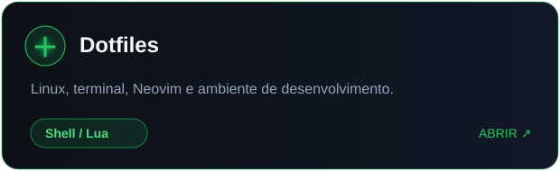
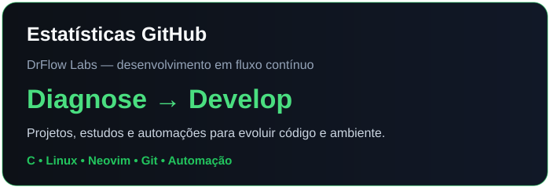
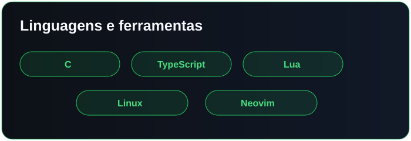

<div align="center">


<br/>

[](https://github.com/DrFlow-Labs)
[](https://github.com/DrFlow-Labs?tab=followers)


</div>

---

<table>
<tr>
<td width="58%" valign="top">

## 🧪 Sobre o laboratório

A **DrFlow Labs** é um espaço para estudar tecnologia, testar ideias e transformar problemas em projetos funcionais.

O nome representa o processo:

```text
Diagnose → Design → Develop → Debug → Deliver
```

- **Dr** — investigar, diagnosticar e resolver;
- **Flow** — manter código, ferramentas e aprendizado em movimento;
- **Labs** — experimentar sem medo de refatorar.

</td>
<td width="42%" align="center">


</td>
</tr>
</table>

---

## 🧬 Áreas de estudo

<div align="center">


<br/><br/>


</div>

---

## 🗂️ Projetos

<table>
<tr>
<td width="50%">
<a href="https://github.com/DrFlow-Labs/curso_c">

</a>
</td>
<td width="50%">
<a href="https://github.com/DrFlow-Labs/jogo_da_velha_c">

</a>
</td>
</tr>
<tr>
<td width="50%">
<a href="https://github.com/DrFlow-Labs/campo_minado_c">

</a>
</td>
<td width="50%">
<a href="https://github.com/DrFlow-Labs/dotfiles">

</a>
</td>
</tr>
</table>

---

## 📊 Métricas

<div align="center">




<br/><br/>


<br/>


</div>

---

## 🐍 Fluxo de contribuições

<div align="center">


</div>

> A animação acima precisa do workflow `snake.yml` configurado no repositório `.github`.

---

## ⚙️ Filosofia

<div align="center">

```text
Entender antes de abstrair.
Simplificar antes de otimizar.
Testar antes de confiar.
Documentar para continuar.
```

<br/>


### `Keep the code flowing.`


</div>
